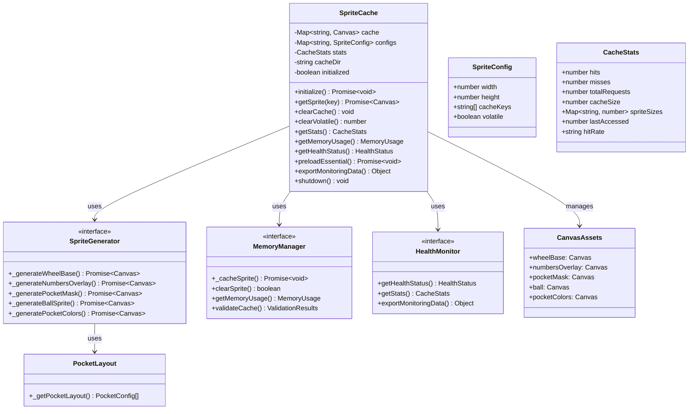
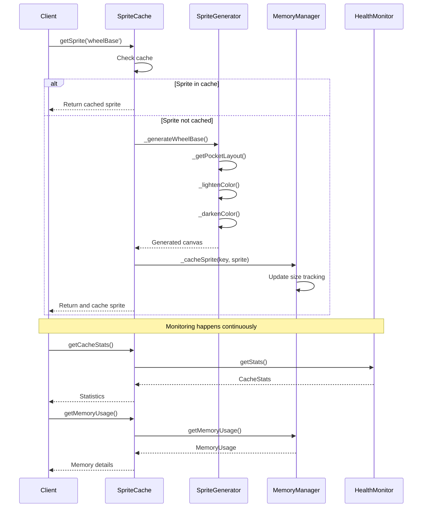
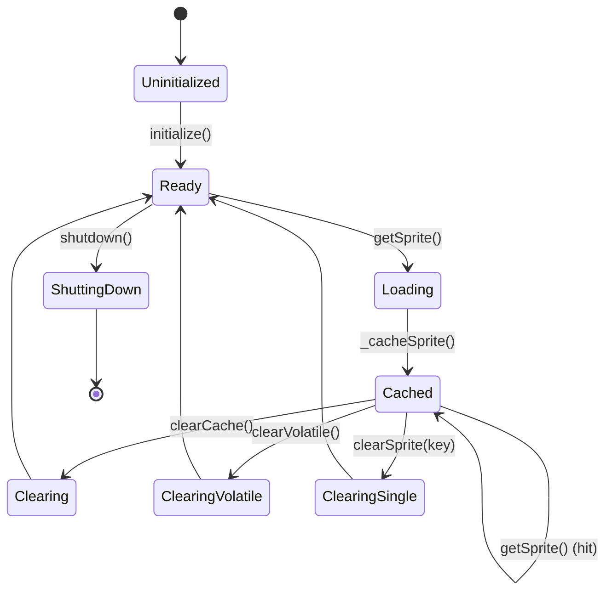
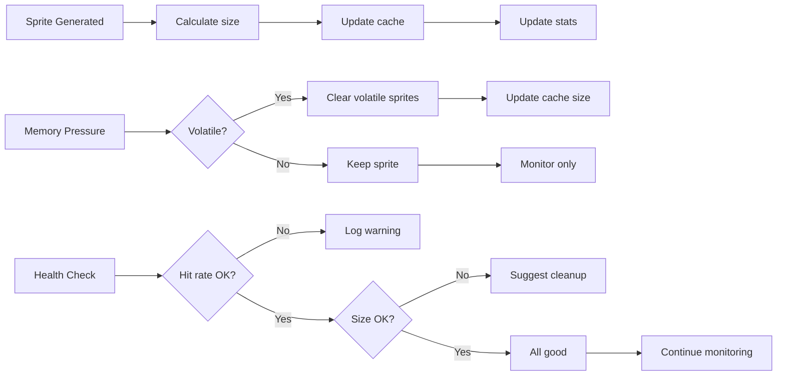
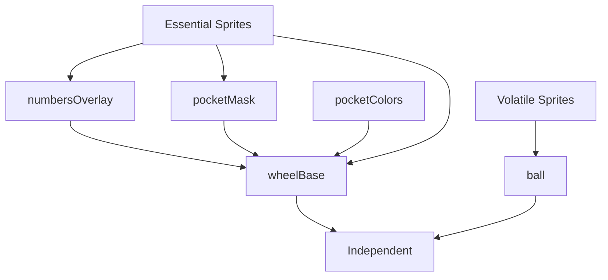
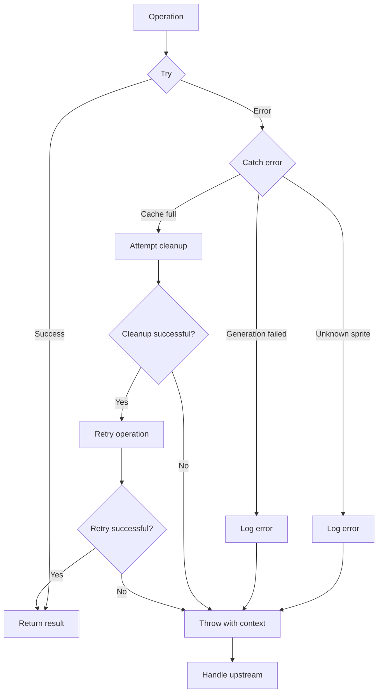

# Sprite Cache System Architecture

## System Overview

The Sprite Caching System is designed to efficiently manage and render roulette wheel assets with optimal performance and memory usage.

## Architecture Diagram



## Data Flow



## Cache Lifecycle



## Sprite Generation Pipeline

```mermaid
flowchart TD
    A[getSprite(key) called] --> B{Sprite in cache?}
    
    B -->|Yes| C[Return cached sprite]
    B -->|No| D[Call _generateSprite(key)]
    
    D --> E{Which sprite?}
    
    E -->|wheelBase| F[_generateWheelBase()]
    E -->|numbersOverlay| G[_generateNumbersOverlay()]
    E -->|pocketMask| H[_generatePocketMask()]
    E -->|ball| I[_generateBallSprite()]
    E -->|pocketColors| J[_generatePocketColors()]
    
    F --> K[Cache sprite]
    G --> K
    H --> K
    I --> K
    J --> K
    
    K --> C
    
    F --> L[Draw metallic rim]
    F --> M[Draw bevel effects]
    F --> N[Draw 37 pockets]
    F --> O[Draw center hub]
    
    G --> P[Draw number text]
    G --> Q[Add shadows]
    
    H --> R[Create binary mask]
    H --> S[Define pocket shapes]
    
    I --> T[Draw 3D ball]
    I --> U[Add specular highlight]
    
    J --> V[Apply colors]
```

## Memory Management Flow



## Cache Key Dependencies



## Performance Monitoring

```mermaid
gantt
    title Cache Performance Metrics
    dateFormat  X
    axisFormat %Ss
    
    section Generation
    wheelBase (600x600)      :active, gen1, 0, 80
    numbersOverlay (600x600) :active, gen2, 0, 70
    pocketMask (600x600)     :active, gen3, 0, 75
    ball (40x40)             :active, gen4, 0, 20
    
    section Cache Operations
    First Request            :milestone, m1, 0, 0
    Cache Hit                :milestone, m2, 50, 0
    Volatile Clear           :milestone, m3, 120, 0
```



## Error Handling Flow



## Integration Points

```mermaid
graph LR
    subgraph "Roulette System"
        A[Roulette Manager] --> B[Sprite Cache]
        C[Canvas Renderer] --> B
        D[Animation System] --> B
    end
    
    subgraph "Sprite Cache"
        B --> E[getSprite()]
        B --> F[getStats()]
        B --> G[clearCache()]
        B --> H[getHealthStatus()]
    end
    
    subgraph "Canvas Assets"
        E --> I[wheelBase]
        E --> J[numbersOverlay]
        E --> K[pocketMask]
        E --> L[ball]
    end
    
    I --> M[Draw to canvas]
    J --> M
    K --> M
    L --> M
    
    M --> N[Display wheel]
```

## Component Responsibilities

### SpriteCache Class
- **Primary Interface**: Entry point for all sprite operations
- **Cache Management**: In-memory sprite storage and retrieval
- **Delegation**: Routes operations to specialized components
- **Monitoring**: Aggregates statistics from sub-components

### SpriteGenerator Class
- **Asset Creation**: Generates all sprite types using node-canvas
- **Visual Effects**: Implements metallic, bevel, and shadow effects
- **Layout**: Manages pocket positioning and numbering
- **Optimization**: Efficient rendering techniques

### MemoryManager Class
- **Size Tracking**: Monitors memory usage per sprite
- **Cache Cleanup**: Implements clearing strategies
- **Validation**: Ensures cache integrity
- **Optimization**: Suggests memory optimizations

### HealthMonitor Class
- **Metrics Collection**: Gathers performance data
- **Health Assessment**: Evaluates system status
- **Reporting**: Exports monitoring data
- **Alerts**: Identifies issues and warnings

## Key Design Patterns

### 1. Singleton Pattern
- Single SpriteCache instance across application
- Centralized management
- Consistent state

### 2. Factory Pattern
- Sprite generation on-demand
- Lazy initialization
- Configurable creation

### 3. Observer Pattern (implicit)
- Stats tracking
- Health monitoring
- Event logging

### 4. Strategy Pattern
- Different clearing strategies
- Volatile vs permanent sprites
- Memory management policies

## Performance Characteristics

### Time Complexity
- **Cache Hit**: O(1) - Direct map lookup
- **Cache Miss**: O(n) - Sprite generation where n = sprite complexity
- **Clear Operations**: O(k) - Where k = number of sprites

### Space Complexity
- **Cache Size**: O(s) - Where s = number of cached sprites
- **Memory Tracking**: O(s) - Map of sprite sizes
- **Stats Tracking**: O(1) - Constant overhead

### Scalability
- **Horizontal**: Multiple cache instances (if needed)
- **Vertical**: Automatic sprite generation
- **Load**: Preloading for known workloads

## Security Considerations

- **Input Validation**: Sprite key verification
- **Error Handling**: No sensitive data in errors
- **Resource Limits**: Configurable cache size
- **Cleanup**: Automatic memory management

## Monitoring & Observability

- **Metrics**: Hit rate, memory usage, generation time
- **Logging**: Configurable debug levels
- **Health Checks**: Automated validation
- **Export**: Monitoring data for external systems
